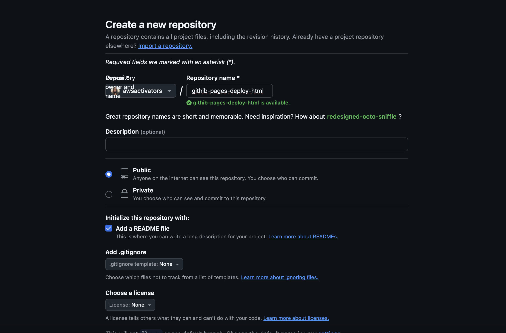
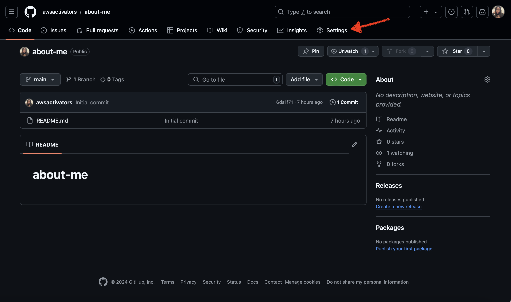
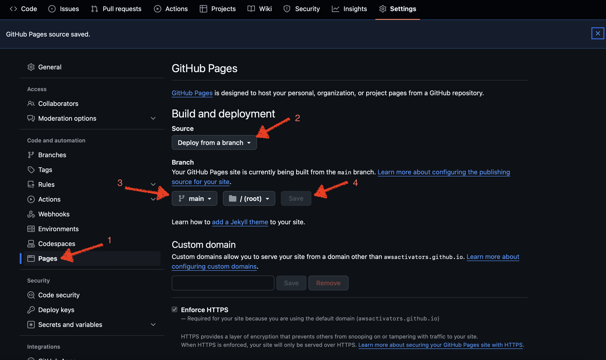
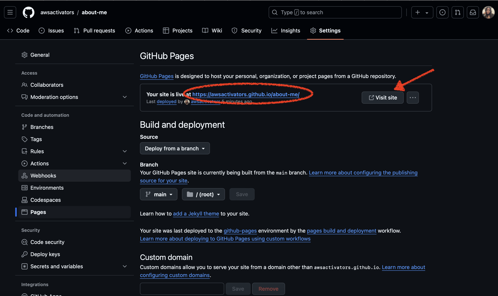

# about-me

This is a repository for hosting on GitHub pages

## Deploy a Static Page to GitHub Pages

[GitHib Pages] allows you to deploy your static HTML, JavaScript, and CSS pages to a GitHub or custom domain. To deploy a repository follow these steps:

1. Create a new standard repository: 

    

    - Give the repo the name `github-pages-deploy-html`
    - Give the repo a brief description `Deploying a static page using GitHub Pages.`
    - Check Add a README file
    - For the rest, just leave the defaults
    - Click `Create repository`

2. Using the terminal clone the repo:

    ```
    git clone https://github.com/<github-username>/github-pages-deploy-html
    ```

3. Open the new `github-pages-deploy-html` folder using your IDE of choice. I use Visual Studio Code. Add an `index.html` and add some basic HTML content:

    ```html
    <!DOCTYPE html>
    <html lang="en">
    <head>
        <meta charset="UTF-8">
        <meta http-equiv="X-UA-Compatible" content="IE=edge">
        <meta name="viewport" content="width=device-width, initial-scale=1.0">
        <title>GitHub Pages</title>
    </head>
    <body>
        <h1>Hello GitHub Pages!!</h1>
    </body>
    </html>
    ```

4. Push the changes to your GitHub repo:

    ```
    git add .
    fit commit -m "Added home page"
    git push origin main
    ```

5. Using the browser, navigate back to `githib-pages-deploy-html` repo, click on the `settings` tab, and then `Pages`.

    


6. Choose `Deploy from branch`, the branch name and folder you want to deploy, then click save:

    

7. Refresh the page for the GitHub URL. 

    


The URL will be:

```
http://<GITHUB_USERNAME>.github.io/<REPO_NAME>
```


